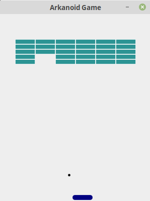

# Arkanoid Game

Game developed in Model-View-Controller (MVC) pattern using Java Swing.

Project developed for Event-driven programming on Faculty of Electronics and Information Technology.

Game view:

